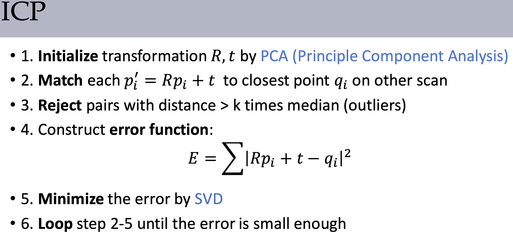
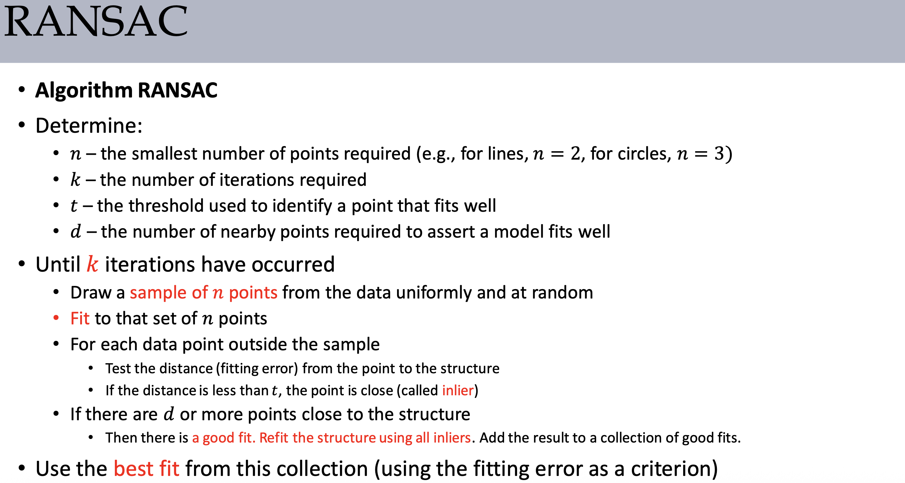
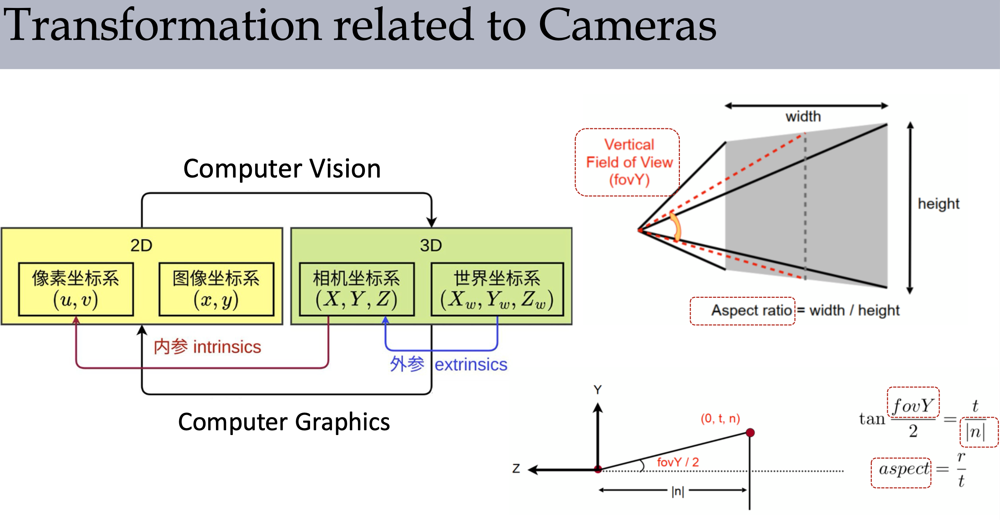

# Geometry

## Polygon mesh and Half-edge data structure

Triangle mesh: Vertex table + Edge table + Triangle table

Half-edge structure:

```cpp
struct HalfEdge {
  HalfEdge *twin; // 共边面片对应的半边
  HalfEdge *next; // 同一个面片的下一条边
  Vertex *vertex; // 边的起点或者终点，自行钦定
  Edge *edge; // 相关的边
  Face *face; // 相关的面片
}
```

Quad mesh:

易于差值和参数化

## Subdivision surface

### Catmull-Clark

1. 计算新的面点和边点
   
   $$
   \begin{aligned}
   f_p & = \frac{1}{n}\sum_{v \in F} v \\
   e_p & = \frac{f_1+f_2+v_1+v_2}{4}
   \end{aligned}
   $$

2. 更新顶点

   $$
   \begin{aligned}
   R &=\frac{1}{edge(v)}\sum_{e \owns v} \text{midpoint} (e) \\
   F &= \frac{1}{face(v)}\sum_{f \owns v} f_p(f)\\
   v_{new} & = \frac{F+2R+(n-3)v}{n} \quad (n=face(v))
   \end{aligned}
   $$

3. 形成新的 Quad mesh。
   
   面点与原始面的边点相连，新的顶点与原始点的边的边点相连。

这里可以保证细分之后的 Polygon mesh 一定是 Quad mesh。

### Loop

1. 计算边点，如果不是边界，那么
   
   $$
   e_p = \frac{3}{8}(v_0+v_2)+\frac{1}{8}(v_1+v_3)
   $$
  
   否则就直接用中点

   $$
   e_p = \frac{1}{2}(v_0 + v_1)
   $$

2. 更新顶点。 $v_i$ 为 $v$ 的邻居，$n$ 是邻居数量，当 $n=3$ 时 $u=\frac{3}{16}$ 其他时为 $\frac{3}{8n}$。
   
   $$
   v' = (1 - n * u) v + u\sum_{i=1}^{n} v_i
   $$

3. 形成新的 Triangle mesh。
   
   一个面的三个边点相连，原始边的边点与两个更新后的顶点相连。

## Mesh Parameterization


- 平均系数 $\lambda_{ij} = \frac{1}{n_i}$
- 均值坐标系数 $\lambda_{ij} = \frac{\tan \frac{\beta_{ji}}{2} + \tan \frac{\alpha_{ij}}{2}}{r_{ij}}$
- 调和坐标系数 $\lambda_{ij} = \frac{\cot \gamma_{ij} + \cot \gamma_{ji}}{2}$，近似于保角映射

## Discrete differential geometry

### Normal Vector

单个三角形的法向量是朴素的，关键是如何定义顶点的法向量。

### 三角坐标及对应的梯度

### 拉普拉斯算子

余切拉普拉斯

### 梯度与拉普拉斯

梯度：标量场 f 的变化方向

拉普拉斯：场 f 的细节

## Mesh smoothing

Diffusion equation

$$
\frac{\partial f(\mathbf x ,t)}{\partial t} = \lambda \Delta f(\mathbf x,t)
$$

由于 $\Delta f(\mathbf x, t)$ 在这里有离散形式，所以还可以写成矩阵的形式。

$$
\frac{\partial \mathbf f(t)}{\partial t} = \lambda L \mathbf f(t)
$$

对时间和空间离散，并使用显式欧拉，那么有

$$
\mathbf x_i \leftarrow \mathbf x_i + h\cdot \lambda \cdot \Delta \mathbf x_i
$$

余切算子能更好地保持几何特征，而均匀算子导致了三角网格切向的松弛

## Mesh editing

限制 $v'_i = u_i , i \in C$

求

$$
\tilde{V'} = \argmin_{V'} \Big ( \parallel L(V') - L(V) \parallel^2 + \sum _{i \in C} \parallel v'_i - u_i \parallel ^2\Big)
$$

## Mesh simplification

How much does it cost to collapse an **edge**?

Basic idea: compute edge midpoint, measure **quadric error**

Better idea: choose a point that **minimizes** quadric error

Quadric error: new vertex should minimize its sum of **square distance** (L2 distance) to **previously related triangle planes**!

Square distance to a single plane: $h_d^2= \tilde{v}^T \big(\frac{\mathbf{\tilde n}\mathbf{\tilde n}^T}{\mathbf n \mathbf n^T} \big) \tilde{v}$

Quadric error: sum of square distances: $\text{Error}(v) = \tilde{v}^T\sum K_p \tilde{v} =  \tilde{v}^T Q \tilde{v}$

## Reconstruction

### Registration

Definition: transform one model to another based on their partially overlapping features

Alignment: find a correct transformation



PCA: 

1. The eigenvectors form orthogonal axes (2 vectors in 2D; 3 vectors in 3D)
2. Compute $R, t$ from one to another

$$
P = \begin{bmatrix}
p_{1x} - c_x & \cdots & p_{nx}-c_x \\
p_{1y} - c_y & \cdots & p_{ny} -c_y \\
p_{1z} - c_z & \cdots & p_{nz} - c_z
\end{bmatrix}
\\

M = PP^T
$$

Eigenvectors of $M$ represent principal directions of shape variation.

SVD $P$ to get eigenvectors of $M$.

### Surface Reconstruction Algorithm

Directly: Triangulation

- Delaunay Triangulation

Indirectly: Implicit Surfaces + Marching Cubes

- Poisson Surface Reconstruction

**Delaunay:**

最大化所有三角形中最小的角

最后的结果是任何三角形的外接圆内，都不包含任何点。

增量式进行，每次向当前集合中添加一个点并连接一些边组成三角形，随后检查受到影响的周围的三角形是否满足德劳内性质，并对不满足性质的三角形进行翻转。

可以通过分治算法优化。

Poisson Surface Reconstruction: 计算 SDF 然后行进立方体

假设 $\chi_M$ 是形状 $M$ 对应的 SDF，我们通过计算 $\nabla \chi_M = 0$ 来表示 $\partial M$。

The input is oriented points $\vec{V}$ (points with normals) sampled from a shape $M$.

由于 $\nabla \chi = \vec{V}$ 所以 $\Delta \chi = \nabla \cdot \vec{V}$

然后估计最小二乘解。（上面的 $\Delta \chi$ 可以用矩阵形式描述）

算法通过八叉树 (Octree) 组织这些带法向量信息的点并在八叉树节点上定义一系列**基函数**，通过求解上述泊松方程得到**基函数之间组合的系数**，从而最终拟合出指示函数．

**Marching Cubes:**

分割若干个立方体，用 SDF 的到 256 中情况，根据不同的情况重建表面。

关于边上的点，要按照 SDF 的值来插值计算。

## RANSAC



按照内点数量判断是否继续，最后用内点重新计算答案。

1. 随机选择一个用于估算的最小子集（对于估计平面来说，该子集包含 3 个点）
2. 用这个子集估算待求的参数
3. 用估算的参数测试整个数据集，将误差在一定范围内的数据点作为“内点”(inliers)
4. 如果内点的数量超过一定比例，就以全部内点为输入，使用最小二乘法重新估计一组更精确的待求参数
5. 重复 1-4 步若干次，最后将“用最多内点估计出的参数”作为最终结果．

## Transformation

### Axis-angle rotation in matrix representation

$$
\mathbf x' = \cos \theta \mathbf x + (1 - \cos \theta) (\mathbf x \cdot \mathbf a)\mathbf a + \sin \theta (\mathbf a \times \mathbf x)
$$

The matrix $R$ for rotation by $\theta$ about axis (unit) $\mathbf a$:

$$
R = \mathbf a \mathbf a ^T + \cos \theta (I - \mathbf a \mathbf a ^T) + \sin \theta \mathbf a ^* \\
\mathbf a ^* = \begin{bmatrix}
0 & -\mathbf a_z & \mathbf a_y \\
\mathbf a_z & 0 & \mathbf -a_x\\
- \mathbf a_y & \mathbf a_x & 0
\end{bmatrix}
$$

### 欧拉角

### 各种变换

- Translation
- Rotation
- Shear
- Scale
- Coordinate transformation
- ...

用齐次坐标，全部可以写成矩阵的形式，方便复合。

二维的**旋转**可以分解为两个类似于**剪切**的变换的复合。

### 铰接模型 Articulated Model

某些部位自由度受限。

有依赖关系，前面改变了后面也要改变。

### Viewing Projection

near plane 就是成像平面

far plane 是考虑的最远的平面（渲染范围）

分为**正交投影**（Orthographic projection）和**透视投影**（Perspective projection），由于透视投影不是线性的，所以要使用**齐次坐标**来计算。

这里的坐标都是列向量，所以是 $P' = M P$。

在求透视投影的矩阵时，如何计算 $z'$ 是不知道的，但是我们知道 $z'= az+b$，然后用 $z_{near},z_{far}$ 来求解 $a,b$ 即可。

注意，在计算了透视投影后，在接一个正交投影映射到长方体中，然后根据 z-buffer 确定如何显示。

在真实的相机中：

