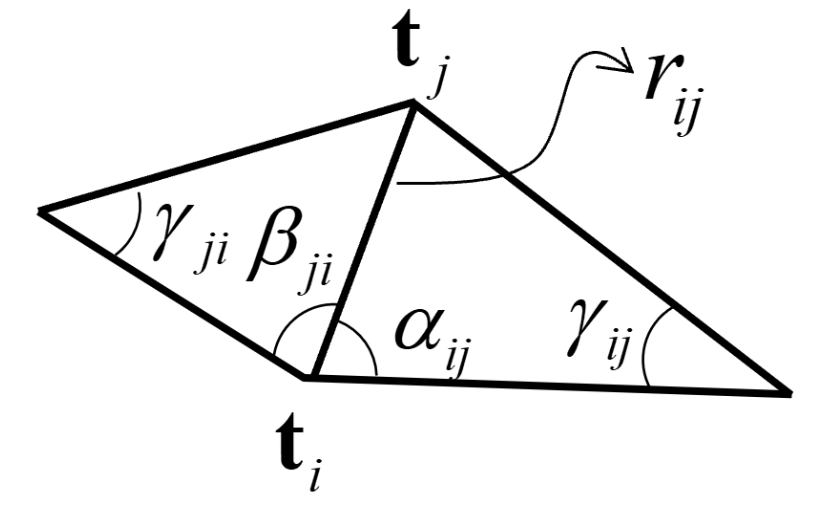

## Geometry

### Polygon mesh and Half-edge data structure

Triangle mesh: Vertex table + Edge table + Triangle table

Half-edge structure:

```cpp
struct HalfEdge {
  HalfEdge *twin; // 共边面片对应的半边
  HalfEdge *next; // 同一个面片的下一条边
  Vertex *vertex; // 边的起点或者终点，自行钦定
  Edge *edge; // 相关的边
  Face *face; // 相关的面片
}
```

Quad mesh:

易于差值和参数化

### Subdivision surface

#### Catmull-Clark

1. 计算新的面点和边点
   
   $$
   \begin{aligned}
   f_p & = \frac{1}{n}\sum_{v \in F} v \\
   e_p & = \frac{f_1+f_2+v_1+v_2}{4}
   \end{aligned}
   $$

2. 更新顶点

   $$
   \begin{aligned}
   R &=\frac{1}{edge(v)}\sum_{e \owns v} \text{midpoint} (e) \\
   F &= \frac{1}{face(v)}\sum_{f \owns v} f_p(f)\\
   v_{new} & = \frac{F+2R+(n-3)v}{n} \quad (n=face(v))
   \end{aligned}
   $$

3. 形成新的 Quad mesh。
   
   面点与原始面的边点相连，新的顶点与原始点的边的边点相连。

这里可以保证细分之后的 Polygon mesh 一定是 Quad mesh。

#### Loop

1. 计算边点，如果不是边界，那么
   
   $$
   e_p = \frac{3}{8}(v_0+v_2)+\frac{1}{8}(v_1+v_3)
   $$
  
   否则就直接用中点

   $$
   e_p = \frac{1}{2}(v_0 + v_1)
   $$

2. 更新顶点。 $v_i$ 为 $v$ 的邻居，$n$ 是邻居数量，当 $n=3$ 时 $u=\frac{3}{16}$ 其他时为 $\frac{3}{8n}$。
   
   $$
   v' = (1 - n * u) v + u\sum_{i=1}^{n} v_i
   $$

3. 形成新的 Triangle mesh。
   
   一个面的三个边点相连，原始边的边点与两个更新后的顶点相连。

### Mesh Parameterization



- 平均系数 $\lambda_{ij} = \frac{1}{n_i}$
- 均值坐标系数 $\lambda_{ij} = \frac{\tan \frac{\beta_{ji}}{2} + \tan \frac{\alpha_{ij}}{2}}{r_{ij}}$
- 调和坐标系数 $\lambda_{ij} = \frac{\cot \gamma_{ij} + \cot \gamma_{ji}}{2}$，近似于保角映射